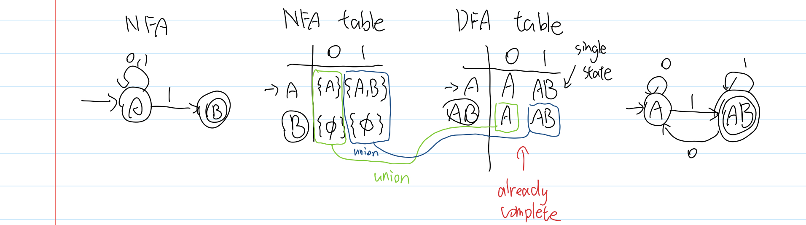
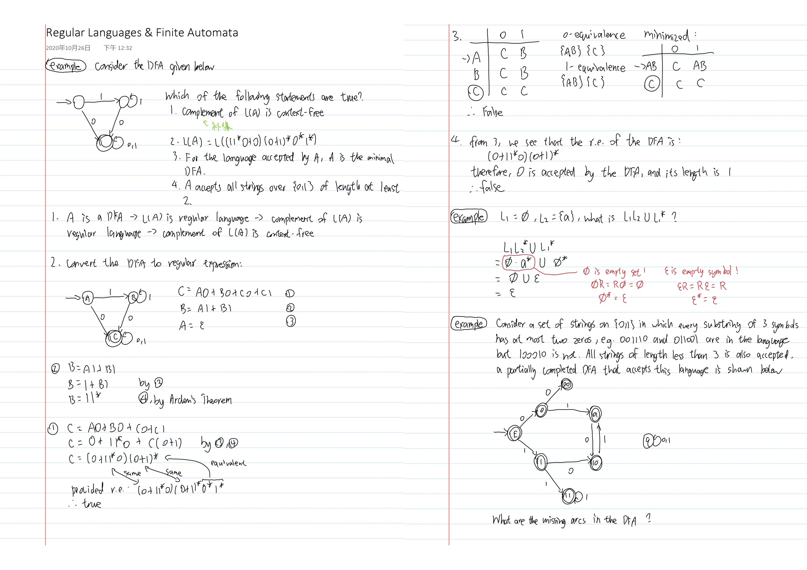

# theory-of-computation-notes

Notes for the theory of computation (decision, computation, and language)

### Contents

* DFA
* Regular Language
* NFA
* Convert NFA to DFA
* Regular Expression
* NFA to Regular Expression
* DFA to Regular Expression
* Regular Expression to Finite Automata
* Minimization of DFA
* Pumping Lemma
* Equivalence of Two Finite Automata
* Regular Grammar
* Context Free Grammar
* Regular Languages & Finite Automata
* Derivation Tree
* Ambiguous Grammar
* Simplification of CFG
* Chomsky Normal Form
* Greibach Normal Form
* Pumping Lemma for CFL
* Pushdown Automata
* Turing Machine
* Decidability

### Files

`Complexity of Algorithms Notes.pdf` Notes in PDF format

`Complexity of Algorithms Notes.pdf` Notes in PDF format; rearranged so that it can be printed into a booklet (left-binding, flips on the short edge)

